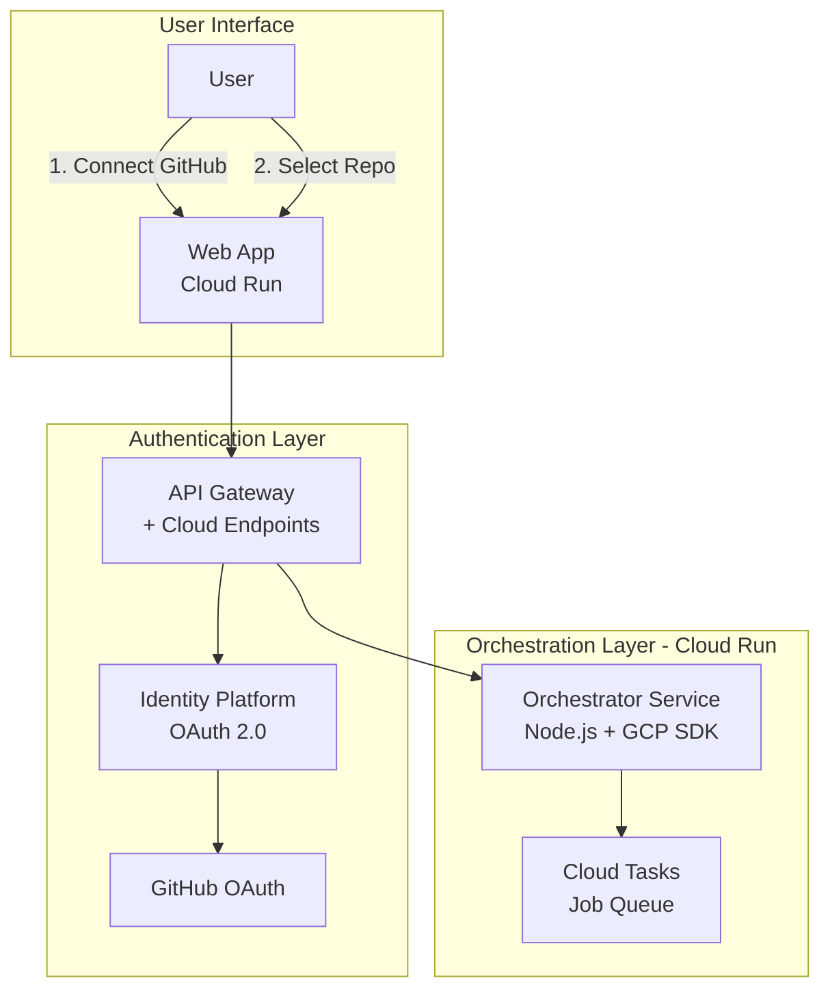
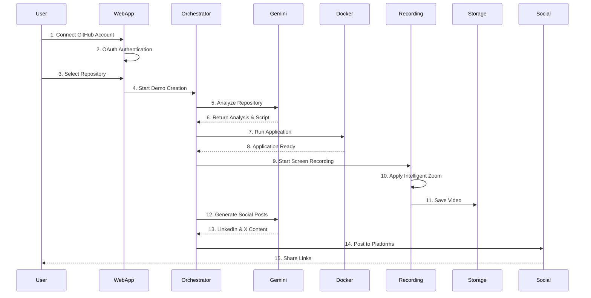

# Video Demo Agent - Architecture with Gemini AI & GCP

## Overview
This architecture leverages Google Cloud Platform (GCP) services and Gemini AI to create an automated video demo generation system. The system analyzes GitHub repositories, creates demo videos, and posts to LinkedIn and X/Twitter.

## High-Level Architecture


    %% AI Processing Layer
    subgraph "AI Layer - Vertex AI"
        OR -->|3. Analyze Repo| VA[Vertex AI<br/>Gemini Pro]
        VA -->|Repo Understanding| GM1[Gemini:<br/>Code Analysis]
        VA -->|Script Generation| GM2[Gemini:<br/>Content Creation]
        VA -->|Post Writing| GM3[Gemini:<br/>Social Media]
    end

    %% Execution Layer
    subgraph "Execution Layer - GCP"
        MQ -->|4. Run Docker| CR[Cloud Run Jobs<br/>Docker Execution]
        CR --> AR[Artifact Registry<br/>Container Images]
        CR -->|5. Screen Record| VM[Compute Engine<br/>GPU Instance]
        VM --> FF[FFmpeg<br/>Recording]
    end

    %% Storage Layer
    subgraph "Storage Layer"
        FF -->|6. Store Video| CS[Cloud Storage<br/>Video Bucket]
        GM2 --> FS[Firestore<br/>Scripts & Metadata]
        OR --> FS
    end

    %% Social Media Layer
    subgraph "Social Media Integration"
        CS -->|7. Post Video| SM[Social Media Service<br/>Cloud Functions]
        SM --> LI[LinkedIn API]
        SM --> X[X/Twitter API]
        FS -->|Post Content| SM
    end

    %% Monitoring
    subgraph "Monitoring & Logging"
        OR --> CL[Cloud Logging]
        CR --> CL
        SM --> CL
        CL --> CM[Cloud Monitoring<br/>Alerts]
    end
```

## User Journey Flow



## Key Components

### 1. Gemini AI Integration (Vertex AI)
- **Model**: Gemini 1.5 Pro via Vertex AI
- **Functions**:
  - Repository analysis and understanding
  - Demo script generation
  - Social media content creation
  - Intelligent zoom point detection

### 2. GCP Services Architecture

```javascript
// Core GCP SDK Integration
const {Storage} = require('@google-cloud/storage');
const {Firestore} = require('@google-cloud/firestore');
const {VertexAI} = require('@google-cloud/vertexai');
const {CloudTasksClient} = require('@google-cloud/tasks');

class GCPOrchestrator {
  constructor() {
    this.storage = new Storage();
    this.firestore = new Firestore();
    this.vertexAI = new VertexAI({
      project: process.env.GCP_PROJECT,
      location: 'us-central1'
    });
    this.tasks = new CloudTasksClient();
    
    // Initialize Gemini model
    this.gemini = this.vertexAI.getGenerativeModel({
      model: 'gemini-1.5-pro',
      generationConfig: {
        temperature: 0.7,
        maxOutputTokens: 8192,
      }
    });
  }

  async analyzeRepository(repoUrl) {
    const prompt = `Analyze this GitHub repository: ${repoUrl}
    Provide:
    1. Project purpose and key features
    2. Main technologies used
    3. Demo script (2-3 minutes)
    4. Zoom points for important code/UI elements`;
    
    const result = await this.gemini.generateContent(prompt);
    return result.response.text();
  }
}
```

### 3. Infrastructure as Code (Terraform)

```hcl
# Cloud Run Service for Orchestrator
resource "google_cloud_run_service" "orchestrator" {
  name     = "video-demo-orchestrator"
  location = "us-central1"

  template {
    spec {
      containers {
        image = "gcr.io/${var.project}/orchestrator:latest"
        env {
          name  = "GCP_PROJECT"
          value = var.project
        }
        resources {
          limits = {
            cpu    = "2000m"
            memory = "2Gi"
          }
        }
      }
    }
  }
}

# Firestore Database
resource "google_firestore_database" "main" {
  project     = var.project
  name        = "(default)"
  location_id = "us-central1"
  type        = "FIRESTORE_NATIVE"
}

# Cloud Storage Buckets
resource "google_storage_bucket" "videos" {
  name          = "${var.project}-demo-videos"
  location      = "US"
  storage_class = "STANDARD"
  
  lifecycle_rule {
    condition {
      age = 30
    }
    action {
      type = "Delete"
    }
  }
}
```

### 4. Security & Monitoring

#### Security Configuration
- **Authentication**: Google Identity Platform with GitHub OAuth
- **API Security**: Cloud Endpoints with rate limiting
- **Secrets**: Google Secret Manager for API keys
- **Network**: VPC with private subnets

#### Monitoring Setup
```yaml
alerts:
  - name: high-error-rate
    condition: error_rate > 0.05
    duration: 5m
    
  - name: slow-video-generation
    condition: video_generation_time > 600s
    
  - name: gemini-api-failures
    condition: gemini_error_count > 10
    duration: 5m
```

### 5. Cost Optimization
- **Serverless First**: Cloud Run scales to zero
- **Spot Instances**: For GPU recording nodes
- **Lifecycle Policies**: Auto-delete old videos
- **Regional Resources**: Single region deployment

## Deployment Guide

```bash
# 1. Set up GCP project
gcloud projects create video-demo-agent
gcloud config set project video-demo-agent

# 2. Enable required APIs
gcloud services enable \
  run.googleapis.com \
  cloudbuild.googleapis.com \
  firestore.googleapis.com \
  aiplatform.googleapis.com

# 3. Deploy infrastructure
terraform init
terraform apply

# 4. Deploy application
gcloud run deploy orchestrator \
  --source . \
  --region us-central1
```