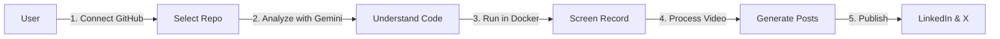

# Video Demo Agent - Quick Architecture Overview

## Simplified User Journey

## Tech Stack
- **AI**: Google Gemini 1.5 Pro (via Vertex AI)
- **Backend**: Google Cloud Platform
  - Cloud Run (orchestration)
  - Cloud Tasks (job queue)
  - Firestore (metadata)
  - Cloud Storage (videos)
  - Compute Engine (GPU recording)
- **Security**: OAuth 2.0, Secret Manager, VPC

## Key Features
1. **Intelligent Analysis**: Gemini understands your code
2. **Automated Recording**: Smart zoom on important elements
3. **Social Optimization**: Platform-specific content
4. **Secure Execution**: Isolated Docker containers

## Getting Started
See [ARCHITECTURE.md](./ARCHITECTURE.md) for detailed implementation.