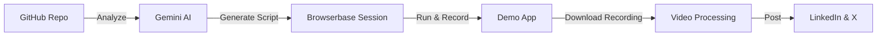

# Browserbase Integration for Video Demo Agent

## Overview
Browserbase is a cloud platform for running headless browsers with built-in recording, session replay, and debugging capabilities. This makes it an ideal solution for the video demo agent's screen recording needs.

## Why Browserbase?

### Current Architecture Challenges
- Managing Docker containers for browser isolation
- Complex FFmpeg setup for screen recording  
- Handling browser crashes and resource management
- Implementing zoom and recording synchronization

### Browserbase Solutions
- **Managed Infrastructure**: No need to manage browser instances
- **Built-in Recording**: Sessions are automatically recorded using rrweb
- **Session Replay**: Complete DOM reconstruction with timeline
- **Live Debugging**: Real-time session inspection capabilities
- **Framework Support**: Native Playwright, Puppeteer, Selenium integration
- **Scalability**: Cloud-native with automatic scaling

## Simplified Architecture



## Key Benefits
1. **Reduced Complexity**: No Docker, no FFmpeg setup for recording
2. **Built-in Features**: Recording, replay, debugging out of the box
3. **Better Reliability**: Managed browser infrastructure
4. **Cost Effective**: Pay-per-minute, no idle resources
5. **Developer Experience**: Simple API, great debugging tools
## Implementation Guide

### 1. Session Creation and Recording
```javascript
import { Browserbase } from "@browserbasehq/sdk";
import { chromium } from "playwright-core";

const bb = new Browserbase({
  apiKey: process.env.BROWSERBASE_API_KEY
});

async function createDemoRecording(demoScript) {
  // Create a session with recording enabled
  const session = await bb.sessions.create({
    projectId: process.env.BROWSERBASE_PROJECT_ID,
  });

  // Connect Playwright
  const browser = await chromium.connectOverCDP(session.connectUrl);
  const context = browser.contexts()[0];
  const page = context.pages()[0];
  
  // Run demo
  await runDemoScript(page, demoScript);
  
  // Close and retrieve recording
  await browser.close();
  
  return session.id;
}
```

### 2. Converting rrweb Recording to Video
```javascript
class RrwebToVideoConverter {
  async convert(sessionId, outputPath) {
    // Get recording from Browserbase
    const recording = await bb.sessions.recording.get(sessionId);
    
    // Set up headless browser for replay
    const browser = await puppeteer.launch({
      headless: true,
      args: ['--no-sandbox']
    });
    
    const page = await browser.newPage();
    await page.setViewport({ width: 1920, height: 1080 });
    
    // Load rrweb player
    await page.goto('data:text/html,<html><body></body></html>');
    await page.addScriptTag({ 
      url: 'https://unpkg.com/rrweb-player/dist/index.js' 
    });
    
    // Initialize player with recording
    await page.evaluate((events) => {
      window.player = new rrwebPlayer({
        target: document.body,
        props: { events, width: 1920, height: 1080 }
      });
    }, recording.events);
    
    // Capture frames
    const frames = await this.captureFrames(page);
    
    // Convert to video
    await this.framesToVideo(frames, outputPath);
    
    await browser.close();
  }
}
### 3. Intelligent Zoom in Post-Processing
```javascript
async function applyIntelligentZoom(frames, zoomPoints) {
  return frames.map((frame, index) => {
    const timestamp = index * (1000 / 30); // 30 fps
    const zoom = findActiveZoom(timestamp, zoomPoints);
    
    if (zoom) {
      return cropAndScale(frame, zoom);
    }
    return frame;
  });
}
```

### 4. Complete Demo Creation Flow
```javascript
async function createDemo(repoUrl) {
  // 1. Analyze repository with Gemini
  const analysis = await analyzeWithGemini(repoUrl);
  
  // 2. Start local demo app
  const appUrl = await startDemoApp(analysis.setupCommands);
  
  // 3. Create Browserbase session and record
  const sessionId = await createDemoRecording({
    url: appUrl,
    actions: analysis.demoScript,
    duration: 120000 // 2 minutes
  });
  
  // 4. Convert recording to video with zoom
  const videoPath = await convertToVideo(sessionId, analysis.zoomPoints);
  
  // 5. Generate social media posts
  const posts = await generateSocialPosts(analysis);
  
  // 6. Publish
  await publishToSocial(videoPath, posts);
  
  return { sessionId, videoPath, posts };
}
```

## Migration Benefits

### Before (Complex Infrastructure)
- Manage Docker containers
- Configure FFmpeg
- Handle browser crashes
- Complex security setup
- High maintenance overhead

### After (Browserbase)
- Simple API calls
- Automatic recording
- Built-in error handling
- Managed security
- Focus on features, not infrastructure

## Next Steps
1. Sign up for Browserbase account
2. Update environment variables
3. Implement rrweb to video converter
4. Test with sample repositories
5. Update deployment guides