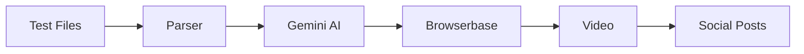

# POC Architecture

## System Overview

## Components

### Test Parser
- Extracts Playwright/Cypress steps
- Converts to action sequence

### Gemini AI  
- Model: Gemini 2.0 Flash
- Analyzes tests & generates posts

### Browserbase
- Cloud browser service
- MCP integration
- Auto recording

### Video Export
- rrweb to MP4
- Simple conversion

## Tech Stack
- Node.js 18+
- Google Gemini API
- Browserbase SDK
- FFmpeg

## Required Keys
1. Browserbase API
2. Google Cloud Project
3. GitHub Token

## Data Flow
1. Parse tests → Extract steps
2. Run on site → Record session  
3. Export video → Generate posts

## API Endpoints
- Browserbase: api.browserbase.com
- Gemini: generativelanguage.googleapis.com