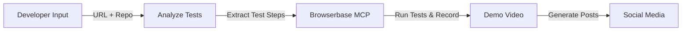

# Video Demo Agent - POC Specification

## Simplified POC Workflow



## POC Scope (2-4 Hours)

### Input
- **Deployed Website URL**: e.g., `https://myapp.vercel.app`
- **GitHub Repository**: Access to test files
- **Test Framework**: Playwright, Cypress, or Selenium tests

### Process
1. **Test Analysis** (30 min) - Parse test files and extract steps
2. **Browserbase Recording** (1 hour) - Run tests and record
3. **Video Generation** (30 min) - Convert recording to MP4
4. **Social Posts** (30 min) - Generate and post content

## Key Insight
Instead of creating demo scripts from scratch, we use existing test files as the demo script. Tests already show the key features and user flows!

## Implementation Overview

### 1. Test Parser
```javascript
// Extract test steps from Playwright/Cypress tests
const testSteps = await parseTestFiles(repoPath);
// Returns: [{ action: 'click', selector: '#login', description: 'Click login button' }]
```

### 2. Browserbase MCP Execution
```javascript
// Use Claude with Browserbase MCP to run tests on deployed site
const sessionId = await runTestsWithBrowserbase(deployedUrl, testSteps);
```

### 3. Video Export
```javascript
// Simple recording to video conversion
const videoPath = await exportVideo(sessionId);
```